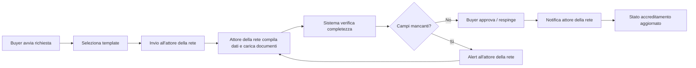
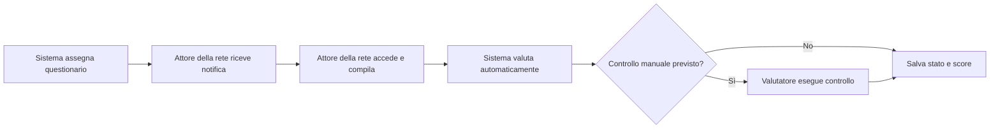
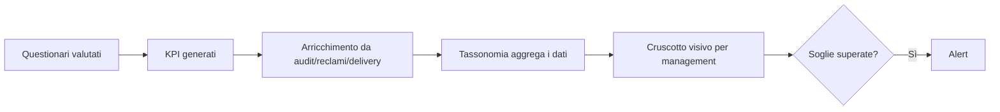
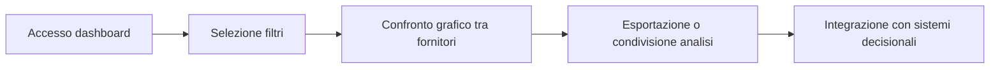

# Diagrammi di Flusso BPMN – Gestione Fornitori

## 🧩 Flusso 1: Accreditamento

```mermaid
flowchart LR
    A[Buyer avvia richiesta] --> B[Seleziona template]
    B --> C[Invio all'attore della rete]
    C --> D[Attore della rete compila dati e carica documenti]
    D --> E[Sistema verifica completezza]
    E --> F{Campi mancanti?}
    F -- No --> G[Buyer approva / respinge]
    F -- Sì --> H[Alert all'attore della rete]
    H --> D
    G --> I[Notifica attore della rete]
    I --> J[Stato accreditamento aggiornato]
```

## 🧩 Flusso 2: Compilazione questionari

```mermaid
flowchart LR
    A[Sistema assegna questionario] --> B[Attore della rete riceve notifica]
    B --> C[Attore della rete accede e compila]
    C --> D[Sistema valuta automaticamente]
    D --> E{Controllo manuale previsto?}
    E -- No --> G[Salva stato e score]
    E -- Sì --> F[Valutatore esegue controllo]
    F --> G
```

## 🧩 Flusso 3: Generazione KPI

```mermaid
flowchart LR
    A[Questionari valutati] --> B[KPI generati]
    B --> C[Arricchimento da audit/reclami/delivery]
    C --> D[Tassonomia aggrega i dati]
    D --> E[Cruscotto visivo per management]
    E --> F{Soglie superate?}
    F -- Sì --> G[Alert]
```

## 🧩 Flusso 4: Analisi performance

```mermaid
flowchart LR
    A[Accesso dashboard] --> B[Selezione filtri]
    B --> C[Confronto grafico tra fornitori]
    C --> D[Esportazione o condivisione analisi]
    D --> E[Integrazione con sistemi decisionali]
```
