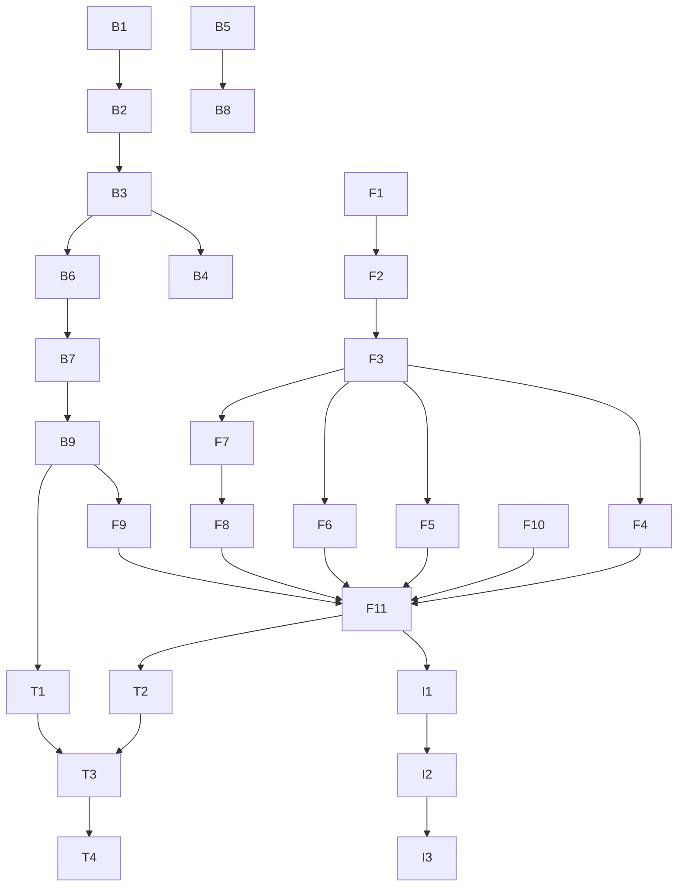

# 📋 Task List: US-B1-015 Questionnaire Template Assignment

**Feature**: Questionnaire Template Assignment Wizard  
**Status**: 🚧 In Progress  
**Start Date**: 2024-06-22  
**Target Completion**: 2024-06-26

## ✅ Progress Overview

- [ ] **Backend API** (0/6 tasks completed)
- [ ] **Frontend Wizard** (0/8 tasks completed) 
- [ ] **Testing & Polish** (0/4 tasks completed)

**Total Progress**: 0/18 tasks (0%)

---

## 🔧 Backend Tasks

### Database & Domain Layer
- [ ] **B1**: Add `Notes` column to Questionnaire table (migration)
- [ ] **B2**: Update Questionnaire entity with Notes property

### Application Layer
- [ ] **B3**: Update `AssignQuestionnaireCommand` with Notes and SendNotifications fields
- [ ] **B4**: Update `AssignQuestionnaireCommandValidator` with Notes validation
- [ ] **B5**: Create `GetActiveTemplatesQuery` and handler for latest active templates
- [ ] **B6**: Update `AssignQuestionnaireCommandHandler` to handle notifications

### API Layer
- [ ] **B7**: Create `QuestionnaireAssignmentsController` with POST endpoint
- [ ] **B8**: Add GET endpoint for active templates
- [ ] **B9**: Add authorization attributes and audit logging

---

## 🎨 Frontend Tasks

### Wizard Infrastructure
- [ ] **F1**: Create `AssignmentWizard.tsx` main container with step management
- [ ] **F2**: Create wizard state management (context or local state)
- [ ] **F3**: Implement step navigation with validation

### Wizard Steps
- [ ] **F4**: Create `TemplateSelectionStep.tsx` with template cards/list
- [ ] **F5**: Create `EntitySelectionStep.tsx` with DataTable and filters
- [ ] **F6**: Create `AssignmentDetailsStep.tsx` with form fields
- [ ] **F7**: Create `ReviewConfirmStep.tsx` with summary
- [ ] **F8**: Create `AssignmentResultDialog.tsx` with tabs

### Integration
- [ ] **F9**: Create API service functions for assignments
- [ ] **F10**: Update `QuestionnaireAssignments.tsx` page to use wizard
- [ ] **F11**: Add routing and navigation

---

## 🌐 Internationalization

- [ ] **I1**: Add English translations for wizard
- [ ] **I2**: Add German translations
- [ ] **I3**: Add Italian translations

---

## 🧪 Testing

- [ ] **T1**: Unit tests for backend commands and queries
- [ ] **T2**: Unit tests for frontend wizard components
- [ ] **T3**: Integration tests for complete assignment flow
- [ ] **T4**: Accessibility tests for wizard navigation

---

## 📝 Documentation

- [ ] **D1**: Update API documentation
- [ ] **D2**: Add user guide for assignment wizard
- [ ] **D3**: Update implementation documentation

---

## 🚀 Deployment Checklist

- [ ] Run database migration for Notes column
- [ ] Deploy backend changes
- [ ] Deploy frontend changes
- [ ] Verify permissions and audit trail
- [ ] Test email notifications
- [ ] Update feature flags if applicable

---

## 📊 Task Dependencies

---

## 💡 Notes

- Backend work can proceed in parallel with frontend wizard infrastructure
- Entity selection step (F5) is the most complex - allocate extra time
- Test with large datasets early to catch performance issues
- Coordinate with DevOps for database migration

---

**Last Updated**: 2024-06-22  
**Updated By**: AI Assistant