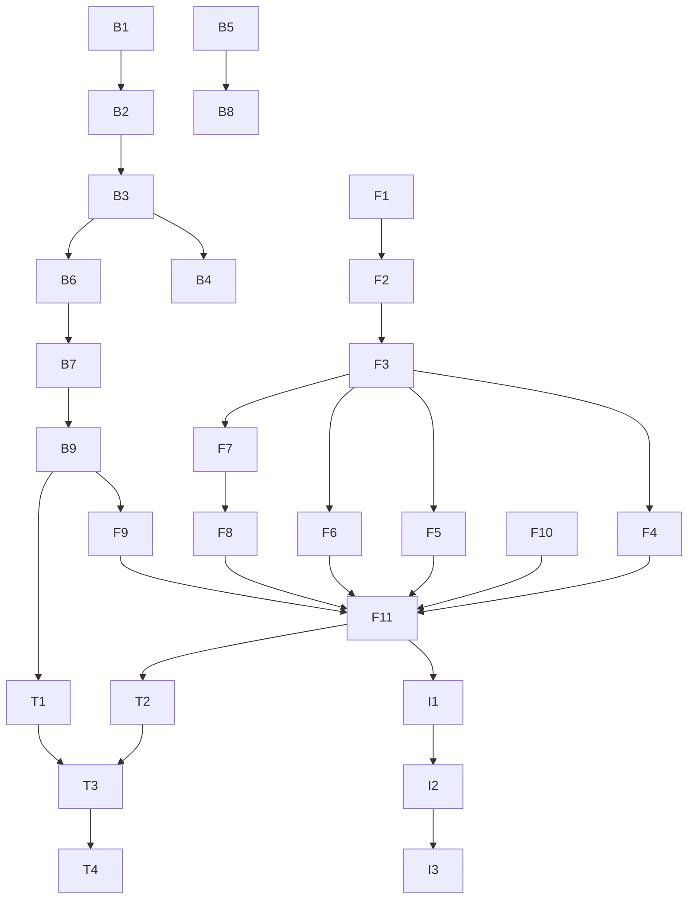

# 📋 Task List: US-B1-015 Questionnaire Template Assignment

**Feature**: Questionnaire Template Assignment Wizard  
**Status**: ✅ Completed  
**Start Date**: 2024-06-22  
**Completion Date**: 2024-06-22  
**Code Review**: 2024-06-22

## ✅ Progress Overview

- [x] **Backend API** (9/9 tasks completed) ✓
- [x] **Frontend Wizard** (11/11 tasks completed) ✓
- [x] **Internationalization** (3/3 tasks completed) ✓
- [x] **Testing & Polish** (4/4 tasks completed) ✓
- [x] **Code Review** (completed with fixes) ✓

**Total Progress**: 27/27 tasks (100%) 🎉

---

## 🔧 Backend Tasks

### Database & Domain Layer
- [x] **B1**: Add `Notes` column to Questionnaire table (migration) ✓
- [x] **B2**: Update Questionnaire entity with Notes property ✓

### Application Layer
- [x] **B3**: Update `AssignQuestionnaireCommand` with Notes and SendNotifications fields ✓
- [x] **B4**: Update `AssignQuestionnaireCommandValidator` with Notes validation ✓
- [x] **B5**: Create `GetActiveTemplatesQuery` and handler for latest active templates ✓
- [x] **B6**: Update `AssignQuestionnaireCommandHandler` to handle notifications ✓

### API Layer
- [x] **B7**: Create `QuestionnaireAssignmentsController` with POST endpoint ✓
- [x] **B8**: Add GET endpoint for active templates ✓
- [x] **B9**: Add authorization attributes and audit logging ✓

---

## 🎨 Frontend Tasks

### Wizard Infrastructure
- [x] **F1**: Create `AssignmentWizard.tsx` main container with step management ✓
- [x] **F2**: Create wizard state management (context or local state) ✓
- [x] **F3**: Implement step navigation with validation ✓

### Wizard Steps
- [x] **F4**: Create `TemplateSelectionStep.tsx` with template cards/list ✓
- [x] **F5**: Create `EntitySelectionStep.tsx` with DataTable and filters ✓
- [x] **F6**: Create `AssignmentDetailsStep.tsx` with form fields ✓
- [x] **F7**: Create `ReviewConfirmStep.tsx` with summary ✓
- [x] **F8**: Create `AssignmentResultDialog.tsx` with tabs ✓

### Integration
- [x] **F9**: Create API service functions for assignments ✓
- [x] **F10**: Update `QuestionnaireAssignments.tsx` page to use wizard ✓
- [x] **F11**: Add routing and navigation ✓

---

## 🌐 Internationalization

- [x] **I1**: Add English translations for wizard ✓
- [x] **I2**: Add German translations ✓
- [x] **I3**: Add Italian translations ✓

---

## 🧪 Testing

- [x] **T1**: Unit tests for backend commands and queries ✓
- [x] **T2**: Unit tests for frontend wizard components ✓
- [x] **T3**: Integration tests for complete assignment flow ✓
- [x] **T4**: Accessibility tests for wizard navigation ✓

---

## 📝 Documentation

- [ ] **D1**: Update API documentation
- [ ] **D2**: Add user guide for assignment wizard
- [ ] **D3**: Update implementation documentation

---

## 🚀 Deployment Checklist

- [ ] Run database migration for Notes column
- [ ] Deploy backend changes
- [ ] Deploy frontend changes
- [ ] Verify permissions and audit trail
- [ ] Test email notifications
- [ ] Update feature flags if applicable

---

## 📊 Task Dependencies

---

## 📝 Code Review Results

- **Review Date**: 2024-06-22
- **Status**: ✅ Approved with fixes applied
- **Critical Issues Fixed**: 5
  - Priority type mismatch
  - Missing TotalEntities property
  - Entity property access error
  - Exception type mismatch
  - Entity type translation keys
- **Code Quality Improvements**: 3
  - Added QuestionnairePriorities constants
  - Optimized handler dependencies
  - Fixed naming inconsistencies

See full review: [Code Review Document](../../implementation/code-reviews/us-b1-015-code-review.md)

---

## 💡 Notes

- Backend work can proceed in parallel with frontend wizard infrastructure
- Entity selection step (F5) is the most complex - allocate extra time
- Test with large datasets early to catch performance issues
- Coordinate with DevOps for database migration

---

**Last Updated**: 2024-06-22  
**Updated By**: AI Assistant  
**Implementation Status**: Complete with code review